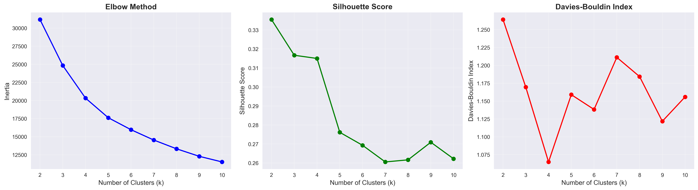

Brain Tumor Detection: MRI Texture Analysis
1. Project Description

This project addresses the critical challenge of early brain tumor detection by analyzing statistical and texture-based features extracted from MRI scans. Using a dataset of 3,762 images, we aim to build a robust diagnostic pipeline that distinguishes between healthy and tumorous tissue. The problem is approached through a multi-stage workflow: performing a data quality audit and exploratory analysis, implementing supervised learning models (Logistic Regression vs. Random Forest), exploring unsupervised natural groupings with K-Means clustering, and finally testing if ensemble techniques using clustering labels as features can improve predictive sensitivity.
2. Dataset Information

    Dataset Name: Brain Tumor Dataset

    Source URL: https://www.kaggle.com/datasets/jakeshbohaju/brain-tumor

    License: CC0: Public Domain

    Details: The dataset includes 13 numerical features capturing pixel intensity distributions (Mean, Variance, Skewness, Kurtosis, etc.) and texture-based features (Energy, Entropy, Homogeneity, etc.). The target variable Class indicates tumor presence (1) or absence (0).

3. Installation and Usage

To reproduce the results, ensure you have Python 3.8+ installed and follow these steps:

    Clone the repository:
    Bash

    git clone https://github.com/your-username/your-repo-name.git
    cd your-repo-name

    Install dependencies:
    Bash

    pip install -r requirements.txt

    Run Notebooks in Order:

        notebooks/T1_EDA.ipynb: Data cleaning, audit, and feature engineering.

        notebooks/T2_Supervised.ipynb: Initial model training and 5-fold cross-validation.

        notebooks/T3_Unsupervised.ipynb: K-Means clustering and Elbow Method analysis.

        notebooks/T4_Ensemble.ipynb: Final ensemble integration and project synthesis.

### **4. Final Model Results**

| Task | Model | Accuracy | Precision | Recall | F1-Score |
| :--- | :--- | :---: | :---: | :---: | :---: |
| **Task 2** | Logistic Regression | 84.7% | 0.83 | 0.82 | 0.83 |
| **Task 2** | **Random Forest (Best)** | **99.0%** | **0.99** | **0.98** | **0.99** |
| **Task 4** | Ensemble (RF + Cluster) | 97.8% | 0.98 | 0.97 | 0.98 |

### **5. Key Visualization**

*Figure 1: Distribution of Entropy across classes. Tumorous scans often exhibit higher complexity and entropy compared to healthy brain tissue.*
